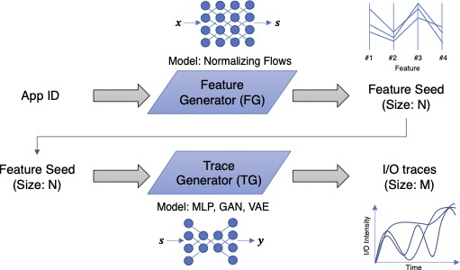

# Deep-learning-based I/O pattern generation

This is to demonstrate how to use generative models to re-produce I/O patterns. 

We analyze real-world, large-scale I/O traces collected in ORNL and build two deep learning models (Feature Generator and Trace Generator). We share our models and parameters to demonstrate generating I/O patterns.

Please check out `FeatureSelection.ipynb` and `TraceGeneration.ipynb` for the demonstration.

## Motivation

Monitoring and analyzing a wide range of I/O activities in an HPC cluster is important in maintaining mission-critical performance in a large-scale, multi-user, parallel storage system. Center-wide I/O traces can provide high-level information and fine-grained activities per application or per user running in the system. Studying such large-scale traces can provide helpful insights into the system. It can be used to develop predictive methods for making predictive decisions, adjusting scheduling policies, or providing decisions for the design of next-generation systems.
However, sharing real-world I/O traces to expedite such research efforts leaves a few concerns; i) the cost of sharing the large traces is expensive due to this large size, and ii) privacy concern is an issue. 

We leverage ML based feature selection and generative models for I/O trace generation. The generative models are trained on I/O traces collected by the darshan I/O characterization tool over a period of one year in ORNL. 

We present a deep-learning-based HPC workload trace generation workflow. We use two models, called the Feature Generator (FG) and the Trace Generator (TG); The FG generates a feature seed of length N for the TG and the TG, taking them as an input, generates time-series I/O traces of length M. We use the Normalizing Flow model for the FG and multi-layer neural networks for the TG.



## Directory structure
The list of directories and the brief descriptions are as follows:
* `data`: data files necessary for training and trace generation, including pre-trained models
* `tracegen`: python module for model definitions and utilities
* `feature_selection`: python notebook to demonstrate feature selection
* `training`: python notebook to demonstrate training
* `trace_generation`: python notebook to demonstrate trace generation

## Trace generation
First, set `PYTHONPATH` 
```
$ export PYTHONPATH=/dir/to/this/directory:$PYTHONPATH
```
Then, in python, import `tracegen` and call `tracegen()` function:
```
import tracegen
scalename, appname, traces = tracegen.tracegen(scaleid=0, appid=1, nsample=20)
```

For more details, please refer to this notebook: `trace_generation/TraceGeneration.ipynb`

## Dependent libraries
The `requirements.txt` contains the list of required Python libraries that you need. They can be installed using:
```
pip install -r requirements.txt
```
